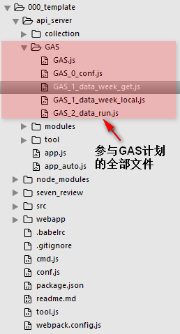

# vue + webpack + express + mongoose + cmd.js

### 1.tpl功能说明

* 前端框架：vue2.0
* 工程化工具：webpack
  * dev模式、build模式；
* 后台框架：express提供API；
* 数据库：mongoose；
* cmd.js：
  * npm run esc_db：一键上传本地数据库到服务器，服务器自动部署为线上的数据库；
  * npm run db_dn：一键下载本地数据库到项目根目录；
  * npm run db_up：一键上传项目根目录下的数据库到本地数据库；
  * npm run git：一键提交代码(里面有 下载数据库到根目录)；
* GAS：参与GAS计划的后台文件；
### 2.特点

* 前端后各自进行检测，提高开发效率；
  * 前端：webpack启动自己的服务器，与后台的API进行代理。
  * 后台：nodemon 对指定的文件夹和文件进行监听，有变化进行重新启动后台服务；
* 集成各自流程化cmd：把流程化的命令行写为一个cmd文件，统一进行管理，方便及时部署和管理数据库，和GitHub提交；

* GAS计划：否参与GAS计划，确认参加，线上代码按照配置项自动每天给GitHub提交代码；

### 3.日志

* 2019/4/17：

    1. 访问GAS项目数据，data_week_get.js完成，
    2. 未完成：自动修改文件进行提交，有GAS文件夹，data_week_get.js的功能放在内部，有gas.conf.js文件。

* 2019/5/3：

    1. 修改2019/4/17已完成工作，重新命名文件名称，是新增的GAS计划只是新增，不影响其他文件；

    2. GAS功能在GAS文件夹下面；

    3. 已完成：

       1. 24小时轮询获取GAS后台大计划数据；
       2. 获取到数据，执行本地计划：
          1. 第一步，获取大计划数据，算出当前天的操作数据（是否要提交，提交几条）；
          2. 第二步，用获取到的数据，对已配置文件和数据格式进行修改相应条数；（被修改文件的数据量有最大最小条数保护）；递归执行完成；流程为每修改一次文件，就进行一次提交；

       

* 2019/5/13：

  1. 把ESC的ids_pub添加到GitHubssh的keys列表；

  2. ESC添加记录GitHub的username和PS：

     1. `git config --global credential.helper store`这一步会在用户目录下的`.gitconfig`文件最后添加：

        ```
        [credential]
            helper = store
        ```

     2. `push`你的代码 (`git push`), 这时会让你输入`用户名`和`密码`, 这一步输入的用户名密码会被`记住`, 下次再push代码时就不用输入用户名密码!这一步会在用户目录下生成文件`.git-credential`记录用户名密码的信息。
     3. 参考文档：<https://blog.csdn.net/ds19980228/article/details/83720450>

  3. 各种界面化的思考：界面化，代表着JS内部设置的参数需要存在数据库里，那就是简单的实现一个对JS参数的增删改查的小demo；

  4. 各种工具插件的思路：

     1. 本次总得来说是开发的一个GAS项目，前期想着是用一个项目完成所有的工作，后期发现一个项目不现实。具体分析看：<https://github.com/zc3hd/demo_GAS>
     2. 后来转变为：一个GAS后台提供数据的服务，其他项目参与GAS计划的JS都写在一个文件夹下，该文件夹包含配置项及所有关的核心文件，不影响其他任何文件；
     3. 从上面的思路上，我也可以把有关通信（IO）、邮件服务（email）等全部转化为功能包的形式，类似插件的形式或者直接生成一个node包（终极目标）；

### 4.未完成

* 2019/5/3：
  1. 指定被修改的文件 未界面化；
  2. 配置被修改的文件的数据格式 未界面化；
  3. 是否要参与GAS几乎 未界面化；
  4. 指定被修改的文件的最大最小数据保护数 未界面化；


